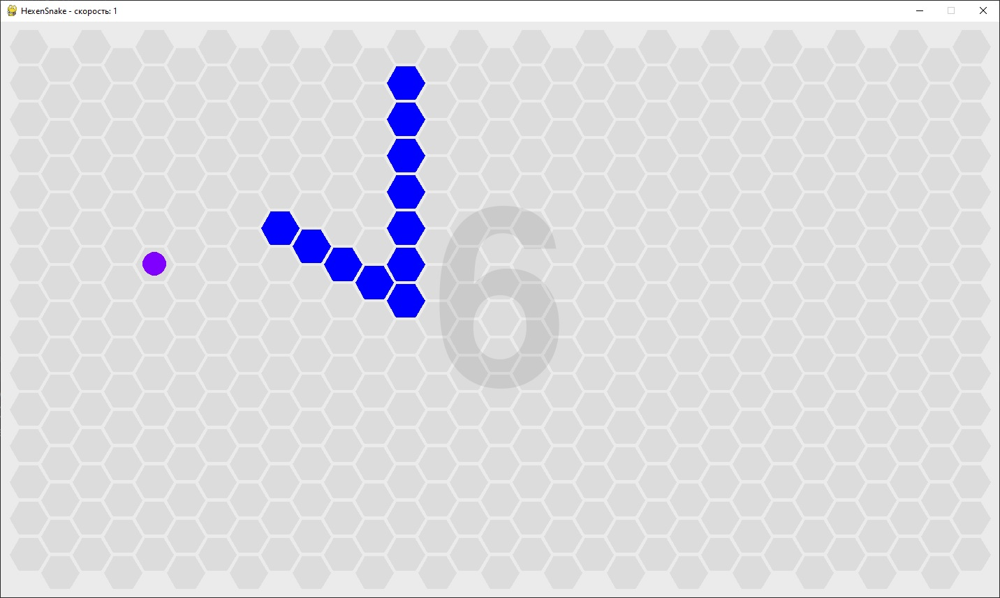
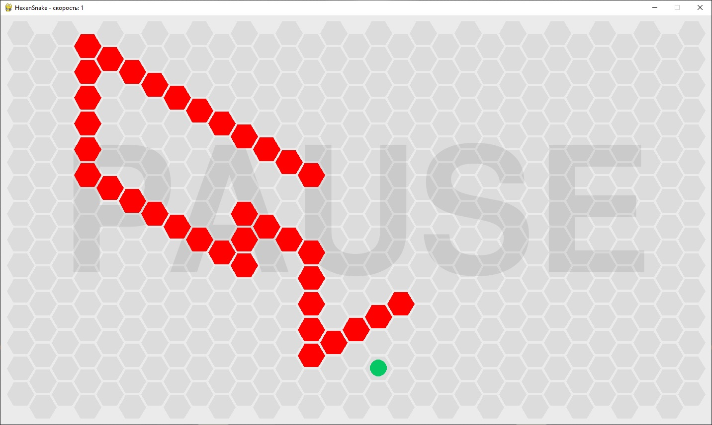
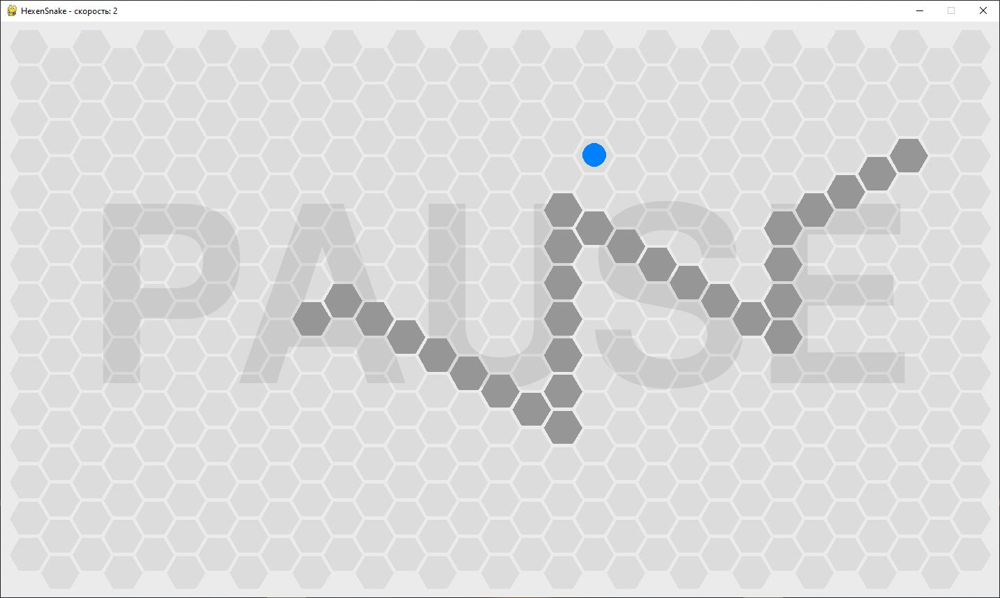

# HexenSnake
Змейка на Python (на поле из гексов)

Игра на Python. Управление происходит кнопками [1], [2], [3], [4], [5], [6] (для выбора направления), [Пробел] (пауза), [+] и [-] (увеличение и уменьшение скорости змейки).
Для рисования игровых объектов использована библиотека pygame.

